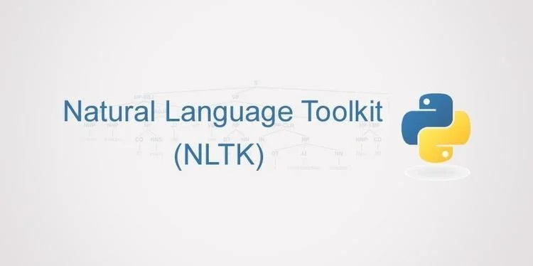

.. role:: text-bold

Un peu d'histoire
================================

Le NLP ou TAL, c'est quoi ça ?
------------------------------
Les recherches dans le domaine du Natural Language Processing (NLP) ou Traitement Automatique du Langage (TAL) ont commencé dans les années 40, surtout après la Seconde Guerre Mondiale. À cette époque, l’importance de la traduction d’une langue à une autre s’est avérée une nécessité (on pense à tous les problèmes d’espionnage qui ont pu avoir lieu, sans parler des communications entre les deux blocs pas toujours aisées). Naturellement, les recherches autour d’une automatisation d’un tel process se sont organisées.

A la fin des années 50, les premières tentatives montrèrent rapidement leurs limites. Les machines employées à ces tâches renvoyaient de phrases insensées mais grammaticalement correctes dos-à-dos avec des phrases insensées et grammaticalement fausses. Noam Chomsky qui a eu une influence décisive dans ces recherches a commencé à postuler que si les hommes pouvaient faire une distinction, la même chose devait être attendue des machines.

Dans les décennies suivantes, les recherches dans le domaine du NLP ont donné naissance à deux écoles : l’école symbolique et l’école stochastique. La première, constituée de linguistes et informaticiens chercheurs, attachée à la structure formelle du langage et la syntaxe (l’ancêtre de l’intelligence artificielle), la seconde intéressée par une approche statistique et/ou probabiliste du langage (reconnaissance de modèles, de récurrences, etc., entre différents corpus de textes).

Après les années 1970, les écoles de recherches dans le domaine se sont encore plus multipliées du fait des avancées dans les domaines de la technologie et du savoir. Il y eut des essais, notamment avec le langage PROLOG. Le premier programme SHDRLU vit le jour, avec un ordinateur qui, dans un environnement simple composé de blocs, pouvait lier des relations entre ceux-ci (par les couleurs, les formes) et répondre de manière juste à des 
Un autre domaine auquel le NLP s’est attaché dans les années 70 est celui du modèle discursif. Il examine les relations et échanges entre personnes et ordinateurs : par exemple pour que l’ordinateur puisse répondre « moi » à une question formulée avec un « tu ».
Dans les années 80, les chercheurs se sont plus focalisés sur des modèles empiristes et probabilistes. Les années 90, quant à elles, ont clairement vu les méthodes statistiques et probabilistes prendre l’ascendant.

Dans les deux dernières décennies, le NLP s’est aussi beaucoup centré sur l’extraction et la génération d’information avec l’explosion d’Internet.
De nos jours, les ordinateurs personnels sont partout et les applications du NLP sont de plus en plus étendues. [#]_

.. raw:: html
    
    

<iframe width="560" height="315" src="https://www.youtube.com/embed/QAJz4YKUwqw?controls=0" title="Le premier programme de NLP" frameborder="0"></iframe>

    

*premier programme de NLP SHRDLU*

Qui ?
-----------------

**Steven Bird** a étudié l'ingénierie informatique à l'Université de Melbourne et réalisé une thèse en linguistique informatique à l'Université d'Edinburgh. Il a aussi étudié, sur le terrain, les langues d'Afrique de l'Ouest, d'Amérique du Sud, d'Asie Centrale, Mélanésie et Australie.

**Edward Loper** est actuellement dans la recherche scientifique chez BBN Technologies (aerospatiale).
Il a une thèse en Computer Science. Ses recherches actuelles portent sur la linguistique informatique et le machine learning. C'est lui le designer à l'origine de NLTK, mais aussi d'epydoc.

**Ewan Klein** est chercheur dans divers domaines : linguistique théorique, phonologie informatique, syntaxe et sémantique, dialogue parlé avec des machines, text mining dans les domaines de la biologie médicale et de l'histoire digitale, l'utilisation des différentes formes de données dans des contextes de recherches, et le I.O.T.

Création
-----------------

Création en 2001, première release en 2005, sachant que la dernière version date de février 2022. 

Quelques domaines d'utilisation de la bibliothèque 
---------------------------------------------------
:text-bold:`Domaines généraux`

Stats, machine learning, IA, sciences cognitives, linguistique, études sémantiques, sachant que la bibliothèque compte plus de 300 packages et modules !

.. NOTE::

    Bien que couvrant plusieurs langues - dont le français, NLTK est avant tout une bibliothèque anglophone.

:text-bold:`Et plus concrètement, dans la vie de tous les jours ?`

- traduction de texte (DeepL par exemple)
- correcteur orthographique
- résumé automatique d’un contenu
- synthèse vocale
- classification de texte
- analyse d’opinion/sentiment
- prédiction du prochain mot sur smartphone
- extraction des entités nommées depuis un texte [#]_

Les objectifs de la bibliothèque 
----------------------------------

NLTK a, à son origine, deux buts : la recherche et l'enseignement dans le domaine du Natural Language Processing (NLP, l'étude et la structure du langage, ou Traitement Automatique des Langues - TAL, en français). Citons la linguistique, l'intelligence artificielle, les sciences cognitives, les sciences de l'information et le machine learning parmi ses bénéficiaires directs.

D'après les auteurs : (Introduction du livre *Natural Language Programming with Python*)

"NLTK a été conçue avec 4 objectifs : 

- **Simplicité** : créer un framework avec des blocs substantiels et faciles à utiliser, donnant aux utilisateurs des outils pratiques pour le NLP. Ceci afin d'éviter les exercices fastidieux de maintenance dans un océan de données sémantiques.

- **Uniformité** : un framework uniformisé, avec une interface cohérente, des structures de données, le tout avec des méthodes aux noms parlants.

- **Elasticité** : donner une structure dans laquelle il est facile d'implémenter de nouveaux modules qui s'intégreraient aisément : alternatives comme concurrents.

- **Modularité** : donner des blocs, des éléments, des composants uniques qui peuvent s'utiliser sans devoir comprendre l'ensemble de la bibliothèque."

A cela, les auteurs ajoutent trois aspects qu'ils ont délibérément "omis" de traiter en créant cette bibliothèque :

"D'abord, NLTK est une boîte à outils, pas une encyclopédie exhaustive ou un système destiné au NLP [...], ensuite, NLTK est une boîte à outils suffisamment élaborée pour remplir de nombreuses analyses et tâches sans pour autant être optimisée en termes de performances matérielles. Nous avons choisi la commodité d'utilisation et de programmation. [...] Enfin, nous avons évité une programmation trop poussive puisque nous croyons en la logique et l'ingéniosité, plutôt qu'en d'indéchiffrables salmigondis algorithmiques."

.. note::
On notera que le NLP se transforme en Natural Language Understanding (NLU) lorsqu'on lui applique des méthodes de machine learning.

Les principaux concurrents 
--------------------------

* **spaCy(Python)**
* **TextBlob(Python)**
* openNLP (Apache)
* Stanford CoreNLP (Python)
* Amazon Comprehend (API Amazon)
* Google Cloud Natural Language (API)
* FuzzyWuzzy(Python)
* Watson Tone Analyzer (IBM)
* Elon Musk ?

La communauté
--------------

La bibliothèque a été principalement développée par Steven Bird et Edward Loper, du département d'informatique et science de l'information, à l'université de Pennsylvanie. Ils ont d'ailleurs défini leur approche dans un ouvrage : *Natural language processing with Python*. La communauté est toujours active à ce jour. Sur Github elle compte 133000 usagers, 354 contributeurs au rang desquels les fondateurs de NLTK. Au regard des graphiques Github, des pics de contribution, et donc de modifications, ajouts, retraits, ont lieu à peu près tous les 4/5 ans depuis une dizaine d'années (notamment lors de la sortie des nouvelles versions de Python).

Roadmap
--------

La dernière mise à jour date de février 2022 et visait à aider à supporter le passage à Python 3.10. Il n'y a pour l'instant, à l'heure où nous écrivons ces lignes, aucune autre mise à jour de prévue.

.. [#] https://www.stat4decision.com/fr/traitement-langage-naturel-francais-tal-nlp/
.. [#] https://cs.stanford.edu/people/eroberts/courses/soco/projects/2004-05/nlp/overview_history.html