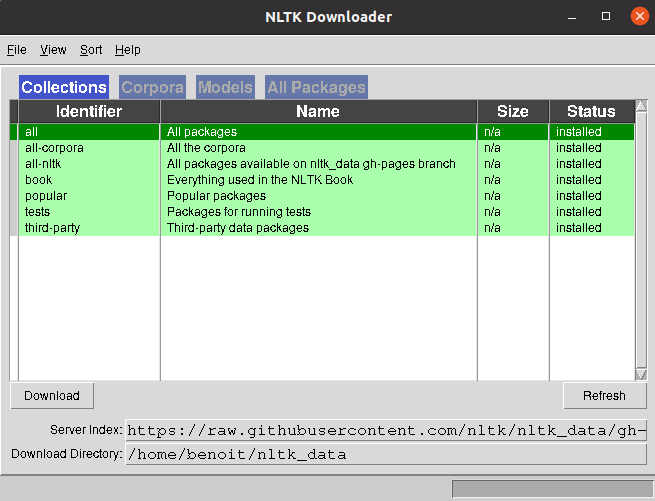

Comment ça marche
=================

Pré-requis
----------
Avoir python d'installé
versions 3.7, 3.8, 3.9 or 3.10

Installation
------------

:text-bold:`Installation du package`
::
    pip install --user -U nltk

:text-bold:`Installation des modèles et des datasets prédéfinis`
::
    #en ligne de commande
    
    python -m nltk.downloader popular

    #ou dans un notebook
    
    nltk.download('popular')

Usage
------
::
    import nltk

    #où l'une de ses méthodes 

    from nltk.stem.snowball import SnowballStemmer
    from nltk.probability import FreqDist
    from nltk.tokenize import word_tokenize

NLTK possède aussi un corpus de textes très fourni pour aiguiser ses armes
::
    from nltk.corpus import hamlet

Principes
---------

- Pré-traitement : une étape qui cherche à standardiser du texte afin de rendre son usage plus facile.
- Représentation du texte comme un vecteur : cette étape peut être effectuée via des techniques de sacs de mots (Bag of Words) ou Term Frequency-Inverse Document Frequency (Tf-IdF). On peut également apprendre des représentations vectorielles (embedding) par apprentissage profond.
- Classification, trouver la phrase la plus similaire… (optionnel)

.. figure:: ./Images/schema.png

Méthode
-------

RTFM

Contraintes
-----------

NLTK fonctionne avec Python version 2 & 3

Technologies
------------
NLTK possède un ensemble de sous-packages et sous-modules pour la visualisation et l'intégration d'API (notamment des API en liens avec les réseaux sociaux)
Les dernières failles de sécurité repertoriées (et réparées) concernaient de possibles attaques ReDoS (Regular Expression Deniol of Service)
