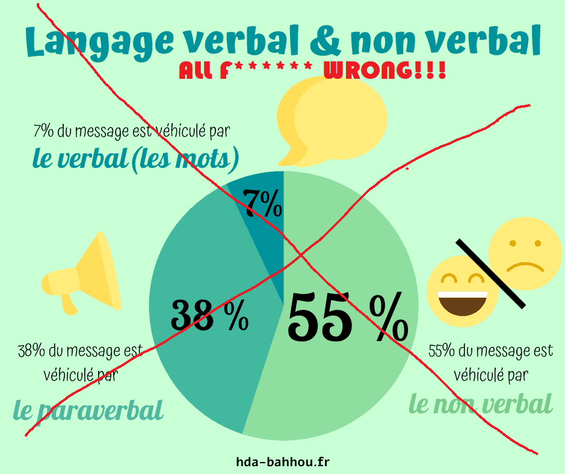

Vocabulaire
============

.. role:: text-bold

.. NOTE::
    Nous allons bien sûr rester ici dans le domaine du vocabulaire propre à la bibliothèque et ne pas nous attarder sur des notions de linguistique qui s'avéreraient trop complexes.

Considérations linguistiques et probabilistes 
----------------------------------------------

Langage
~~~~~~~~~~~~~~
Au sens large, le langage se définit comme un système de signes qui associe des mots selon des règles grammaticales précises. Le langage renvoit à la faculté de raisonner, de nommer les choses et de communiquer avec autrui.

Linguistique 
~~~~~~~~~~~~~~
Science qui a la langue pour objet. 

.. NOTE::
    Au passage, ceci est un mythe, merci de l'oublier pour de bon.
   
   

Sens
~~~~~~~~~~~~~~
En linguistique, le sens est la signification d'une expression (mot, syntagme, phrase, énoncé, etc.), c'est-à-dire l'idée qui y est associée, dite aussi dénotation, avec ou sans connotations. Les interrogations au sujet de ce que constitue la signification, ou le sens, sont à la base de la philosophie du langage.

Analyse sémantique
~~~~~~~~~~~~~~~~~~
L’analyse sémantique consiste à établir la signification d’une phrase en utilisant le sens des éléments la composant. Dans la NLP, elle s'appuie sur les éléments suivants :

- **l’approche linguistique**, avec l'établissement a priori des règles en étudiant le langage ;
- **l’approche statistique**, avec pour base l’analyse de corpus importants, à partir desquels la machine va extraire des règles grâce à l’apprentissage automatique (machine learning) ;
- **les approches hybrides**, situées entre linguistique et statistique qui permettent d’obtenir de meilleurs résultats.

Analyse lexicale
~~~~~~~~~~~~~~~~~~~~~~~~~~~~
L'analyse lexicale est fondée sur la statistique fréquentielle, c'est-à-dire la redondance des traces lexicales et les proximités entre les mots.

Naive Bayes Classifier 
~~~~~~~~~~~~~~~~~~~~~~~~~~~~
C'est un peu l'esprit du fonctionnement de la bibliothèque NLTK.
Le naive Bayes classifier se base sur le théorème de Bayes. Ce dernier est un classique de la théorie des probabilités. Ce théorème est fondé sur les probabilités conditionnelles.

**Probabilité conditionnelle** : quelle est la probabilité qu’un événement se produise sachant qu’un autre événement s’est déjà produit ?

Le terme “naive” vient du fait qu’on suppose l'indépendance des variables.
Ce théorème donne surtout de très bon résultats pour la classification. Ceci est paradoxal car on suppose une indépendance forte entre les différentes conditions.

.. figure:: ./Images/wat.jpg
    :align: center 

Vocabulaire NLTK 
-----------------

Corpus 
~~~~~~

Le package nltk.corpus est un ensemble de classes qui permettent de lire un corpus. Classes qui peuvent être utilisées pour accéder aux contenus d'un ensemble de corpora variés. La liste complète de ces corpora est donnée ici : https://www.nltk.org/nltk_data/

WordNet
~~~~~~~
WordNet est une base de données lexicale développée par des linguistes du laboratoire des sciences cognitives de l'université de Princeton depuis une vingtaine d'années3. Son but est de répertorier, classifier et mettre en relation de diverses manières le contenu sémantique et lexical de la langue anglaise. Des versions de WordNet pour d'autres langues existent, mais la version anglaise est cependant la plus complète à ce jour [#]_ 
Elle est intéégrée au sein de la bibliothèque NLTK. 
Wordnet permet aussi d'obtenir des synonymes ou encore des antonymes. Enfin, elle est disponible dans d'autres packages, elle est Open Source.

Tokenization
~~~~~~~~~~~~~~
Il s'agit de découper le texte en "tokens", le token étant une unité sémantique individuelle avec un sens grammatical. En tokenizant, si un mot apparaît plusieurs fois dans le texte, il sera compté plusieurs fois.

Stop-word
~~~~~~~~~
Ce sont les mots qui sont généralement filtrés avant de traiter un texte. Ils regroupent les mots les plus communs d'un langage (articles, prépositions, pronoms, conjonctions, etc.) qui n'apportent pas beaucoup d'information quant au sens du texte.

Stemming
~~~~~~~~
Un même mot peut se retrouver sous différentes formes en fonction du genre (masculin féminin), du nombre (singulier, pluriel), de la personne (moi, toi, eux…) etc. Le stemming désigne généralement le processus qui consiste à découper la fin des mots afin de n'en conserver que la racine.

Lemmatisation
~~~~~~~~~~~~~~
Cela consiste à réaliser la même tâche mais en utilisant une analyse et un vocabulaire plus fins de la construction des mots. La lemmatisation permet donc de supprimer uniquement les terminaisons inflexibles en isolant la forme canonique du mot, connue sous le nom de lemme.
Il existe plusieurs types de lemmatisation : Porter et Lancaster qui sont basées sur des algorithmes différents, et une troisième basée sur le dictionnaire Wordnet.

Term-Frequency (TF)
~~~~~~~~~~~~~~~~~~~~~~~~~~~~

Cette méthode consiste à compter le nombre d’occurrences des mots présents dans le corpus pour chaque texte. Chaque texte est alors représenté par un vecteur d’occurrences. On parle généralement de Bag-Of-Word, ou sac de mots en français.

.. NOTE::

    Cette approche présente un inconvénient majeur : certains mots sont par nature plus utilisés que d’autres, ce qui peut conduire le modèle à des résultats erronés.

Term Frequency-Inverse Document Frequency (TF-IDF)
~~~~~~~~~~~~~~~~~~~~~~~~~~~~~~~~~~~~~~~~~~~~~~~~~~~~~~~~
Cette méthode consiste à compter le nombre d’occurrences des mots présents dans le corpus pour chaque texte, que l’on divise ensuite par le nombre d’occurrences total de ces mêmes mots dans tout le corpus.

P.O.S. : Parts Of Speech / Tagging
~~~~~~~~~~~~~~~~~~~~~~~~~~~~~~~~~~~~~~~~~~
Cette méthode consiste à analyser la nature sémantique des mots d'un texte : noms, pronoms, adjectifs, verbes, adverbes, conjonctions etc. Il existe plus de 36 catégories de mots (NN pour nom, NNP pour nom propre, DET pour déterminant, etc.).

Chunking
~~~~~~~~~~~~~~
Chunk = morceau. Rassembler des éléments de langages individuels en plus gros groupes (verbaux, nominaux, compléments divers, etc.).

N.E.R. : Name Entity Recognition 
~~~~~~~~~~~~~~~~~~~~~~~~~~~~~~~~~~~~~~~~~~

Vient en complémentarité de la tokenization d'une texte pour identifier des catégories de noms : entreprises, locations, géopolitiques, organisations, personnes, géo-sociologiques. Se fait également à l'aide de la méthode de chunking.

Parsing
~~~~~~~~~~~~~~
Méthode utilisée pour passer en revue tous les éléments d'un texte afin d'en dégager une arborescence. Bien qu'il puisse être utilisé pour identifier les différents éléments d'un texte, le parsing peut aussi servir à analyser les morphèmes (soit les composantes morphologiques d'un mot).

Classification
~~~~~~~~~~~~~~~~~~~~~~~~~~~~
Il représente la structure syntaxique d'une phrase. Dans la bibliothèque NLTK, l'arbre donne une représentation visuelle de l'organisation syntaxique de la phrase, basée sur le travail de tagging . Chaque rameau est relié à une branche par un "node" (nœud), elle-même reliée au tronc qui représente la phrase dans son ensemble.

.. figure:: ./Images/syntax_tree.png
    :align: center 

.. WARNING::

    Plus le vocabulaire du corpus est riche, plus la taille des vecteurs est grande, ce qui peut représenter un problème pour les modèles d’apprentissage.
    Le comptage d’occurrences de mots ne permet pas de rendre compte de leur agencement et donc du sens des phrases.

.. [#] *Source* : https://fr.wikipedia.org/wiki/WordNet