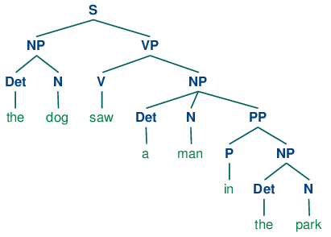

Un peu de Vocabulaire
=====================

.. NOTE::
    Nous allons bien sûr rester ici dans le domaine du vocabulaire propre à la bibliothèque et ne pas nous attarder sur des notions de linguistique qui s'avéreraient par trop complexes.

Tokenization
------------
Il s'agit de découper le texte en "tokens", le token étant une unité sémantique individuelle avec un sens grammatical. En tokenizant, si un mot apparaît plusieurs fois dans le texte, il sera compté plusieurs fois.

Stop-word
---------
Ce sont les mots qui sont généralement filtrés avant de traiter un langage. Ils regroupent les mots les plus communs d'un langage (articles, prépositions, pronoms, conjonctions, etc.) qui n'apportent pas beaucoup d'information quant au sens du texte.

Stemming
--------
Un même mot peut se retrouver sous différentes formes en fonction du genre (masculin féminin), du nombre (singulier, pluriel), de la personne (moi, toi, eux…) etc. Le stemming désigne généralement le processus qui consiste à découper la fin des mots afin de ne conserver que la racine du mot.

Lemmatisation
-------------
Cela consiste à réaliser la même tâche mais en utilisant une analyse et un vocabulaire fins de la construction des mots. La lemmatisation permet donc de supprimer uniquement les terminaisons inflexibles et donc à isoler la forme canonique du mot, connue sous le nom de lemme.

Term-Frequency (TF)
-------------------

Cette méthode consiste à compter le nombre d’occurrences de mots présents dans le corpus pour chaque texte. Chaque texte est alors représenté par un vecteur d’occurrences. On parle généralement de Bag-Of-Word, ou sac de mots en français.

.. NOTE::

    Cette approche présente un inconvénient majeur : certains mots sont par nature plus utilisés que d’autres, ce qui peut conduire le modèle à des résultats erronés.

Term Frequency-Inverse Document Frequency (TF-IDF)
--------------------------------------------------
Cette méthode consiste à compter le nombre d’occurrences de mots présents dans le corpus pour chaque texte, que l’on divise ensuite par le nombre d’occurrences total de ces mêmes mots dans tout le corpus.

P.O.S. : Parts Of Speech / Tagging
----------------------------------
Cette méthode consiste à analyser la nature sémantique des mots d'un texte : noms, pronoms, adjectifs, verbes, adverbes, conjonctions etc. Il existe plus de 36 catégories de mots (NN pour nom, NNP pour nom propre, DET pour déterminant, etc.).

Chunking
---------
Chunk = morceau. Rassembler des éléments de langages individuels en plus gros groupes (verbaux, nominaux, complèments divers etc.).

N.E.R. : Name Entity Recognition 
--------------------------------

Vient en complémentarité de la tokenization d'une texte pour identifier des catégories de noms : entreprises, locations, gopolitiques, organisations, personnes, géo-sociologiques). Se fait également à l'aide de la méthode de chunking.

Parsing
--------
Méthode utilisée pour passer en revue tous les éléments d'un texte afin d'en dégager une arborescence. Bien qu'il puisse être utilisé pour identifier les différents éléments d'un texte, le parsing peut aussi servir à analyser les morphèmes (soit les composantes morphologiques d'un mot).

Arbre syntaxique
-----------------
Il représente la structure syntaxique d'une phrase. Dans la bibliothèque NLTK, l'arbre donne une représentation visuelle de l'organisation syntaxique de la phrase, basée sur le travail de tagging . Chaque rameau est relié à une branche par un "node" (noeud), elle même reliée au tronc qui représente la phrase dans son ensemble.

.. WARNING::

    Plus le vocabulaire du corpus est riche, plus la taille des vecteurs est grande, ce qui peut représenter un problème pour les modèles d’apprentissage.
    Le comptage d’occurrences de mots ne permet pas de rendre compte de leur agencement et donc du sens des phrases.

